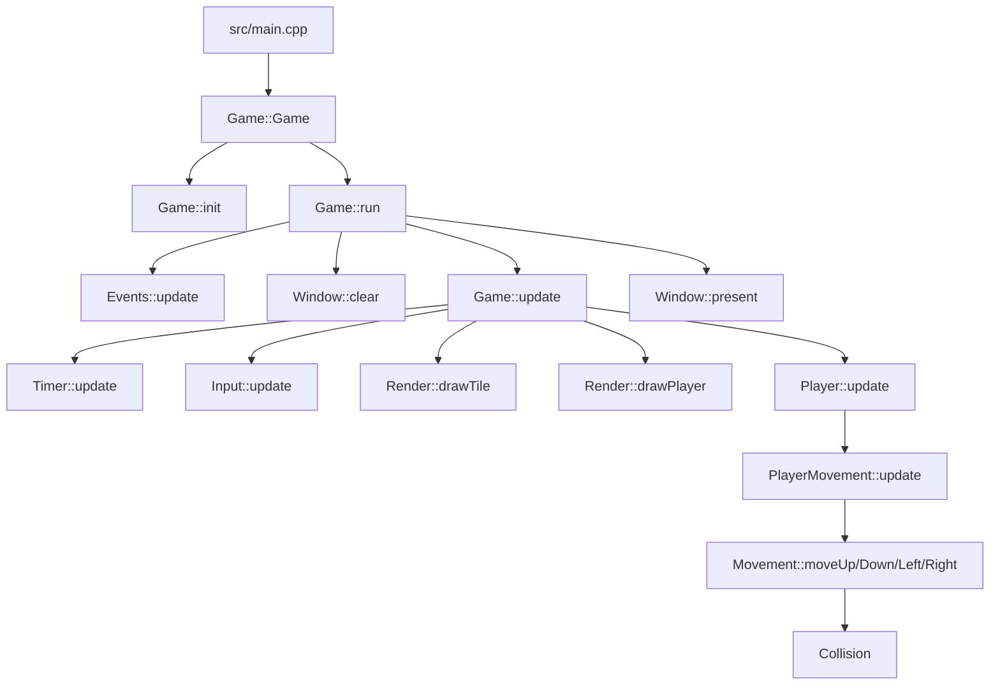

# Documentacion del proyecto Simple Factory 2D

## Resumen general
Simple Factory 2D es un experimento de videojuego 2D hecho en C++ con SDL3 y CMake. El proyecto nacio como una base para aprender arquitectura de juegos, renderizado simple, manejo de eventos, entrada por teclado y separacion por modulos.

En su estado actual, el programa abre una ventana SDL, procesa el evento de cierre, actualiza el teclado, avanza un temporizador, mueve un jugador con WASD y dibuja texturas de prueba sobre la pantalla.

## Objetivo del proyecto
El objetivo principal no es solo tener un juego terminado, sino construir una base tecnica que permita crecer hacia un juego de tipo factory/simulation con:

- entidades jugables y no jugables
- mapa basado en tiles
- colisiones
- sprites y animaciones
- UI y sistemas de juego mas complejos

## Estructura general
El codigo esta organizado por capas:

- `src/main.cpp` arranca la aplicacion.
- `src/game/` contiene la orquestacion principal del juego.
- `src/platform/` encapsula SDL3 para ventana, eventos, render y texturas.
- `src/logic/` contiene input y sistemas de juego.
- `src/entities/` define entidades como `Player` y la base generica `Entity`.
- `src/map/` prepara la estructura para tiles y mapas.
- `src/core/` agrupa tipos compartidos, IDs, rutas y utilidades como el temporizador.

## Flujo de ejecucion
El recorrido real de la aplicacion es este:

La aplicacion vive dentro de un bucle simple mientras `Events::update()` no detecte cierre de ventana.

## Modulos principales

### 1. Punto de entrada
#### `src/main.cpp`
Es el arranque minimo del programa. Crea un objeto `Game` dentro de un bloque `try/catch` para capturar errores fatales y devolver un codigo de salida distinto de cero si algo falla.

### 2. Capa de juego
#### `src/game/simpleFactory.hpp` y `src/game/simpleFactory.cpp`
`Game` es el centro de coordinacion de toda la aplicacion. Sus responsabilidades actuales son:

- crear y mantener el contexto SDL
- crear la ventana y el renderer
- mantener el sistema de eventos
- mantener el input del teclado
- mantener el renderizador de alto nivel
- mantener el jugador
- mantener el temporizador
- ejecutar el bucle principal

Secuencia interna:

1. `Game::Game()` llama a `init()` y despues a `run()`.
2. `init()` conecta el objeto `Input` con `Player`.
3. `run()` repite el ciclo mientras la ventana siga abierta.
4. `update()` recalcula `deltaTime`, lee el teclado, dibuja tiles de prueba, dibuja al jugador y actualiza su movimiento.

### 3. Capa de plataforma
#### `src/platform/window/`
Contiene la abstraccion de ventana SDL.

- `Window` crea `SDL_Window` y `SDL_Renderer`.
- `clear()` limpia la pantalla con un color fijo.
- `present()` muestra el frame actual.
- `setTitle()` cambia el titulo de la ventana.

Esta clase oculta los punteros SDL directos al resto del proyecto.

#### `src/platform/events/`
Contiene la lectura basica de eventos de SDL.

- `Events::update()` procesa la cola de eventos.
- por ahora solo detecta `SDL_EVENT_QUIT`.
- su unica responsabilidad es decirle al bucle principal si debe seguir o cerrarse.

#### `src/platform/rendering/`
Contiene el renderizado de alto nivel y la gestion de texturas.

- `Render` conoce al renderer SDL.
- `drawPlayer()` dibuja una textura asociada a un identificador de asset.
- `drawTile()` dibuja una textura asociada a un identificador de tile.
- `TextureManager` construye los mapas de texturas para personajes y tiles.
- `TextureMap` carga, guarda y libera texturas individuales por ID.

La idea es que `Game` no dibuje texturas directamente, sino que llame a `Render`, y que `Render` resuelva la textura adecuada mediante `TextureManager`.

### 4. Capa de logica
#### `src/logic/input/`
`Input` hace el seguimiento del estado del teclado.

- guarda el estado actual de cada tecla
- guarda el estado anterior para detectar transiciones
- ofrece consultas como `isKeyDown`, `isKeyPressed` y `isKeyReleased`

Esto permite construir logica de movimiento o acciones sin leer SDL directamente desde las entidades.

#### `src/logic/systems/`
Contiene sistemas reutilizables de movimiento, colision y vida.

- `Collision` almacena posicion y tamano del area de colision.
- `Movement` aplica velocidad y `deltaTime` para mover una colision.
- `PlayerMovement` lee el input y llama a `Movement` con WASD.
- `Health` mantiene puntos de vida, curacion y dano.

Estos sistemas estan pensados para ser composables y reutilizables por futuras entidades.

### 5. Capa de entidades
#### `src/entities/primitive/`
`Entity` es la base generica para entidades identificadas por un tipo de ID.

- guarda un ID generico
- contiene una colision base
- sirve como base para futuras entidades de juego

#### `src/entities/player.*`
`Player` es la entidad jugable actual.

- hereda de `Entity<AssetsID>`
- posee `Health`
- posee `PlayerMovement`
- expone `update(deltaTime)` para mover al jugador
- expone `getX()` y `getY()` para que el render pueda dibujarlo

La entidad no lee SDL por su cuenta. En cambio, delega el movimiento a `PlayerMovement`.

### 6. Capa de mapa
#### `src/map/`
Contiene la estructura base para el mundo basado en tiles.

- `Map` mantiene una lista de `Tile<TileID>`
- `Tile` guarda ID, estado solido y visibilidad
- la clase ya prepara colision y posicion, aunque aun no esta integrada al flujo principal de juego

La carpeta existe como base para un futuro mapa, pero todavia no gobierna el render ni la colision del jugador.

### 7. Capa core
#### `src/core/ids/`
Define enumeraciones para identificar assets y tiles.

- `AssetsID` identifica texturas del jugador y otros assets
- `TileID` identifica tiles como `Grass`, `Rock` y `Metal`

#### `src/core/paths/`
Mapea cada ID a una ruta concreta dentro de `assets/`.

- `AssetsPath` asocia IDs de assets con archivos de textura
- `TilesPath` asocia IDs de tiles con texturas de tile

#### `src/core/timer/`
`Timer` calcula tiempo transcurrido y `deltaTime`.

- `update()` calcula el intervalo entre frames
- `getDeltaTime()` entrega el tiempo usado por el movimiento
- `pause()` y `resume()` permiten congelar o reanudar la simulacion

## Relaciones entre modulos
Las relaciones mas importantes son estas:

- `main.cpp` crea `Game`.
- `Game` coordina ventana, eventos, input, render, jugador y timer.
- `Window` encapsula SDL y entrega el `SDL_Renderer` a `Render`.
- `Render` usa `TextureManager` para resolver assets y tiles por ID.
- `TextureManager` usa `TextureMap` para cargar texturas desde rutas declaradas en `core/paths`.
- `Player` usa `PlayerMovement` y `Health`.
- `PlayerMovement` usa `Input` y `Movement`.
- `Movement` modifica `Collision` usando `deltaTime`.
- `Map` y `Tile` preparan la estructura para el mundo, pero aun no son la fuente principal del bucle de juego.

## Assets y recursos
La carpeta `assets/` contiene la estructura esperada por el cargador de texturas:

- `assets/textures/player/`
- `assets/textures/tiles/`
- `assets/textures/items/`

Las rutas reales se definen en `AssetsPath` y `TilesPath`. El renderizado actual depende de que esos archivos existan y sean accesibles desde el directorio de ejecucion.

## Construccion
El proyecto usa CMake y compila una aplicacion llamada `simpleFactory2d`.

El `CMakeLists.txt` actual enlaza los modulos activos de la aplicacion principal y copia la carpeta `assets/` al directorio de salida.

## Estado actual real
Hoy el proyecto funciona como una base tecnica y no como un juego completo.

### Ya existe
- ventana SDL3
- renderer SDL3
- bucle principal
- lectura de input de teclado
- temporizador con `deltaTime`
- dibujo de texturas de prueba
- jugador basico con movimiento

### Esta preparado, pero aun no es central en el juego
- mapa de tiles
- sistema de colisiones real contra el mundo
- entidades adicionales
- UI
- audio
- persistencia

### Observaciones importantes
- Hay archivos de `entities/`, `logic/` y `map/` que aun funcionan mas como base estructural que como gameplay completo.
- La documentacion y el roadmap deben leerse con cuidado, porque parte de la arquitectura esta mas avanzada que la jugabilidad.

## Resumen de responsabilidades por carpeta
- `src/main.cpp`: arranque.
- `src/game/`: orquestacion general.
- `src/platform/`: integracion con SDL3.
- `src/logic/`: input y sistemas reutilizables.
- `src/entities/`: entidades de juego.
- `src/map/`: tiles y mapa.
- `src/core/`: identificadores, rutas y utilidades.

## Lectura rapida del proyecto
Si alguien quiere entender el codigo en poco tiempo, el orden recomendado es:

1. `src/main.cpp`
2. `src/game/simpleFactory.hpp`
3. `src/game/simpleFactory.cpp`
4. `src/platform/window/sdlWindow.*`
5. `src/platform/events/sdlEvents.*`
6. `src/logic/input/inputManager.*`
7. `src/entities/player.*`
8. `src/logic/systems/playerMovement.*`
9. `src/platform/rendering/renderManager.*`
10. `src/platform/rendering/textureManager.*`

Con ese recorrido se entiende el flujo completo de entrada, actualizacion y render.